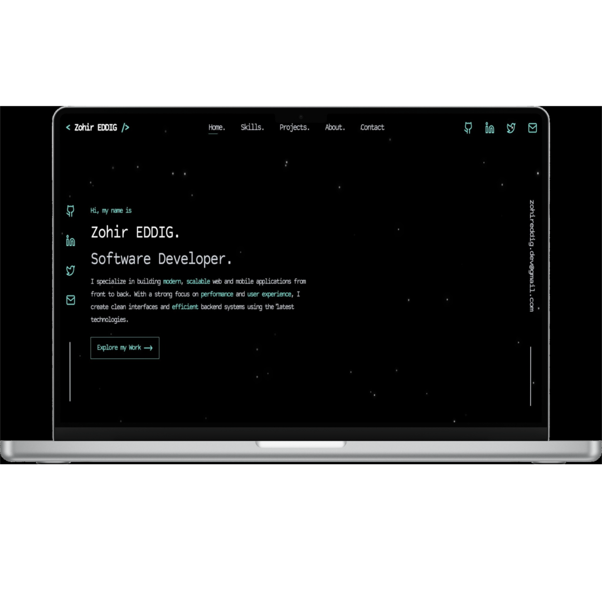
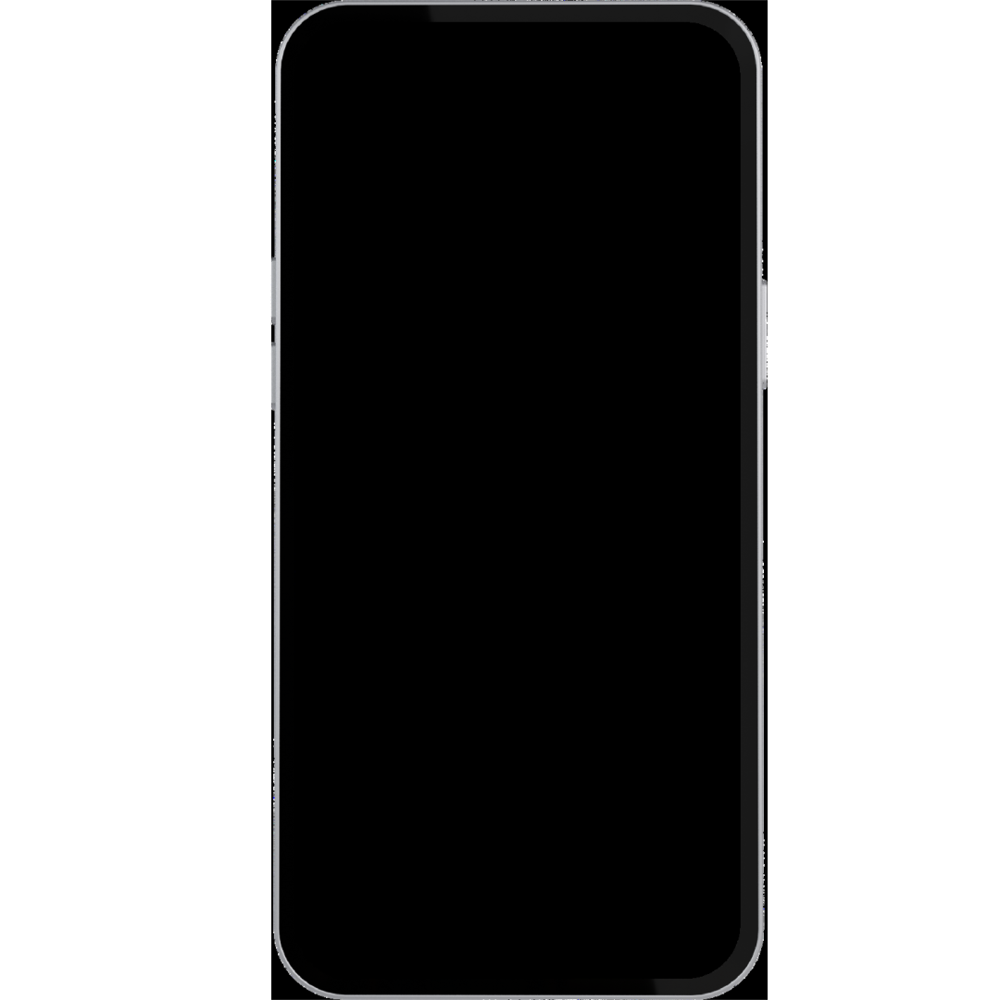

# Zohir EDDIG – Portfolio

A modern, responsive personal portfolio website built to showcase my projects, skills, and tools as a software developer. This portfolio highlights my work, experience, and ways to get in touch, with a clean UI and smooth animations.

## 🌐 Live Demo

👉 [https://zohireddig.netlify.app/](https://zohireddig.netlify.app/)

## 📦 Repository

👉 [https://github.com/ZohirEDDIG/zohir-eddig-portfolio](https://github.com/ZohirEDDIG/zohir-eddig-portfolio)

---

## 🛠 Tech Stack

**Frontend**

* Next.js

**Styling**

* Tailwind CSS

**Animations & UI**

* Framer Motion
* Lucide React (icons)

---

## ✨ Features

* Fully responsive design (mobile, tablet, desktop)
* Projects showcase
* Skills & tools section
* About me section
* Contact section
* Smooth animations and transitions
* Clean and modern UI

---

## 🖼 Screenshots

| Desktop | Mobile |
|------------|-------------|
|  |  |

---

## 🚀 Getting Started

### Prerequisites

* Node.js (v18 or later recommended)
* npm / yarn / pnpm

### Installation

```bash
# Clone the repository
git clone https://github.com/ZohirEDDIG/zohir-eddig-portfolio.git

# Navigate to the project directory
cd zohir-eddig-portfolio

# Install dependencies
npm install

# Run the development server
npm run dev
```

Open `http://localhost:3000` to view the project in your browser.

---

## 📁 Project Purpose

This project was built as a personal portfolio to:

* Showcase real-world projects
* Highlight my technical skills and tools
* Present myself professionally to recruiters and clients

---

## 👤 About Me

**Zohir EDDIG**
Software Developer

I’m a passionate software developer focused on building clean, performant, and user-friendly web experiences.

---

## 📫 Contact

* Portfolio: [https://zohireddig.netlify.app/](https://zohireddig.netlify.app/)
* GitHub: [https://github.com/ZohirEDDIG](https://github.com/ZohirEDDIG)

---

## 📄 License

This project is shared for **demonstration and educational purposes**.

You are welcome to explore the code and run it locally.
Please do not copy, reuse, redistribute, or publish this project
or its design as your own.

© Zohir EDDIG. All rights reserved.